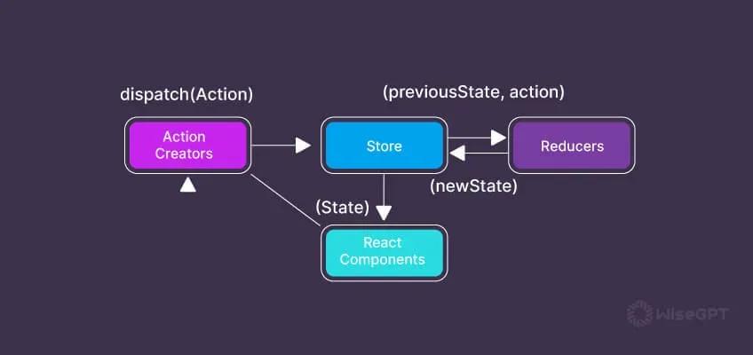
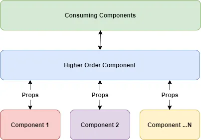

# Course Checkpoint 19

## ¿Qué es Heroku? existen otras alternativas? hazme una tabla si existen similares con los beneficios y desventajas


La plataforma como Servicio ayuda a las empresas a crear y administrar aplicaciones de alto rendimiento. Un PaaS confiable puede ayudar a los desarrolladores a lograr un desarrollo de API simplificado y administrar bases de datos, IoT, comunicaciones y procesos sin dificultad.

Heroku es considerada por el momento una de las plataformas más robustas que ofrece una oferta de servicio para empresas de cualquier tamaño. A continuación analizaremos las características, ventajas y limitaciones de esta popular plataforma.

### ¿Qué es Heroku?

Heroku es una plataforma como servicio ampliamente utilizada que permite a los desarrolladores implementar, escalar y administrar aplicaciones rápidamente.

Esta plataforma ofrece soporte para una amplia gama de lenguajes de programación como Java, Ruby, PHP, Node.js, Python, Scala y Clojure. Heroku ejecuta aplicaciones a través de contenedores virtuales, más conocidos como Dynos.

Heroku cobra a sus usuarios en función de los recursos informáticos como la RAM y las máquinas virtuales dedicadas. La plataforma Heroku y las aplicaciones creadas por los usuarios utilizan Amazon Web Services como infraestructura subyacente. Los desarrolladores pueden crear aplicaciones muy rápidamente utilizando este marco, ya que es bastante fácil de usar y fácil de usar.

Un servicio PaaS como Heroku proporciona un servicio totalmente administrado, resuelve problemas de infraestructura y puede aumentar o reducir automáticamente la cantidad de servidores. En comparación con un proveedor de IaaS puro, proporciona capas adicionales de valor además de los recursos de la máquina virtual.

### ¿Para qué se utiliza Heroku?

Los desarrolladores y las empresas pueden utilizar Heroku para una variedad de aplicaciones, que incluyen:

- Lanzamiento de contenedores inteligentes
- Escalado de aplicaciones
- Bases de datos administradas
- plataformas de iot
- Aplicaciones web

### Beneficios de Heroku

- Facilidad de uso

Como plataforma líder como servicio, Heroku es conocida por su facilidad de uso. Los desarrolladores pueden elegir entre varios paquetes de niveles diferentes que se adaptan mejor a los complejos requisitos de las grandes empresas.

El panel intuitivo de la plataforma Heroku ayuda a los usuarios a escalar, administrar y monitorear aplicaciones fácilmente.

- Centrarse en los desarrolladores

Heroku se centra en ayudar a los desarrolladores a mejorar sus habilidades para crear aplicaciones ricas en funciones. Los desarrolladores disfrutan utilizando este entorno porque obtienen acceso a valiosas herramientas que ayudan a acelerar los procesos de desarrollo centrales.

Están libres de tareas repetitivas y pueden centrarse en actividades críticas de desarrollo. Las poderosas capacidades de Heroku pueden dar vida a cualquier proyecto de desarrollo de aplicaciones. Sigue leyendo para conocer más beneficios de Heroku.

- Permite a los desarrolladores centrarse en escribir código en lugar de administrar servidores.

Heroku elimina la carga de la administración del servidor de los desarrolladores y les brinda acceso a una interfaz web fácil de usar. La implementación con un solo clic también es bastante conveniente para los desarrolladores después de iniciar la aplicación.

Pueden crear rápida y fácilmente nuevas versiones de software, publicar lanzamientos e implementar rápidamente extensiones en diferentes entornos. La facilidad de inicio de Heroku lo convierte en una opción conveniente para el desarrollo de aplicaciones.

- Fácilmente escalable

Heroku PaaS (plataforma como servicio) se basa en Dyno para ejecutar código escrito por desarrolladores. Cada banco de pruebas es un contenedor que incluye recursos como memoria, CPU, código de aplicación y dependencias asociadas.

Los usuarios de Heroku pueden crear cualquier cantidad de copias independientes de una aplicación después de haberla aprovisionado, un proceso conocido como escalado horizontal.

Las aplicaciones que reciben grandes cantidades de tráfico pueden manejar fácilmente la carga creando cientos de instancias de aplicaciones literalmente con un clic. La función de escalado automático de Heroku facilita la detección de picos de tráfico y la creación de Dynos adicionales en consecuencia.

- Seguridad

Heroku ofrece a los desarrolladores una forma segura de desarrollar aplicaciones con sus funciones de seguridad. Heroku garantiza una seguridad óptima para los servidores y el código de la aplicación y evita posibles problemas.

Esta Plataforma como Servicio reduce la necesidad de que los desarrolladores emitan constantemente parches de seguridad, lo que puede resultar muy difícil, especialmente en aplicaciones web complejas. Sigue leyendo para aprender más sobre los beneficios de Heroku.

- Potente interfaz de línea de comandos

La interfaz de línea de comandos de Heroku o CLI es una función que ayuda a desarrollar y administrar aplicaciones Heroku de manera conveniente. La CLI es, de hecho, uno de los componentes más confiables de Heroku PaaS.

- Excelentes complementos y soporte de terceros

El ecosistema Heroku consta de muchos servicios en la nube que satisfacen las necesidades de los desarrolladores. Son muy útiles para crear, administrar y operar aplicaciones.

Los complementos integrados facilitan a los desarrolladores la instalación de servicios y la gestión de configuraciones, facturación y datos desde la interfaz de línea de comandos o el panel de control de Heroku.

Heroku también ofrece varios complementos que ayudan a ampliar la funcionalidad mediante la integración de API, procesos y registros de la plataforma. Algunos de ellos incluyen Bucketeer, Redis To Go, Cloudcube y otros.

- Parte de Salesforce

Heroku Platform as a Service es parte de SalesForce, uno de los nombres más confiables en la industria del software. Desde la adquisición de SalesForce, Heroku también ha avanzado significativamente en su desarrollo y ha logrado muchas más integraciones.

Las empresas trabajan juntas para brindar soluciones de alta calidad para satisfacer las necesidades comerciales en todo el mundo.

Los desarrolladores pueden crear aplicaciones en Heroku y usar Heroku Connect para sincronizar datos entre la implementación de Postgres y SalesForce de Heroku.

Heroku y SalesForce se han asociado para crear un producto PaaS de calidad que hace que el desarrollo de aplicaciones de alta calidad sea rápido y sencillo.

- Soporte empresarial

Heroku Enterprise tiene varias opciones de módulos Pro que ayudan a los desarrolladores a aprovechar al máximo sus aplicaciones.

La empresa tiene un fuerte enfoque en ayudar a las empresas a simplificar sus procesos de desarrollo de aplicaciones. Para empresas, se ofrecen 3 módulos: Evaluación de aplicaciones, Plan de escalamiento de aplicaciones y Propuesta de solución.

### Limitaciones de Heroku

- Precio

Los planes gratuitos ya no estarán disponibles después del 28 de noviembre de 2022, según este anuncio.

Muchos desarrolladores consideran que Heroku es una opción cara en comparación con otras plataformas. Algunos problemas de escala pueden influir en su decisión de elegirlo.

La utilización de recursos no es óptima y los costos de Heroku pueden aumentar. Heroku es más caro que AWS y algunos otros competidores clave.

- Aplicaciones para dormir

Un Web Dyno asignado a una aplicación Heroku entra en modo de suspensión si no ha recibido tráfico durante una hora.

Cuando vuelves a acceder a la aplicación, Dyno se activa automáticamente para su procesamiento. Las aplicaciones inactivas pueden ser un problema potencial para algunas empresas. Sin embargo, las aplicaciones que tienen varios Dynos no entran en suspensión.

- Restricciones regionales

Heroku solo está disponible en las regiones de EE. UU. y Europa, aunque se ejecuta en la plataforma AWS. Al mismo tiempo, puede ser una excelente opción para cualquier empresa con sede en estas dos regiones y que tenga una base de clientes en ellas.

Pero si tiene una empresa con una aplicación con clientes en Asia, puede experimentar problemas de latencia. Esta es una de las limitaciones que obliga a los usuarios potenciales fuera de Europa y EE. UU. a considerar alternativas a Heroku.

Heroku Private Space ahora ofrece otras regiones para elegir, pero esta oferta solo está disponible para clientes empresariales.

- Menos flexibilidad en comparación con IaaS (infraestructura como servicio)

Heroku es una plataforma como servicio y su flexibilidad es comparativamente baja en comparación con IaaS (Infraestructura como servicio). A pesar de proporcionar una gran cantidad de funciones y complementos, la plataforma todavía está limitada en los tipos de desarrollo.

IaaS es un modelo que proporciona la máxima flexibilidad para una variedad de opciones de desarrollo, mientras que PaaS, como Heroku, generalmente se construye sobre IaaS (infraestructura como servicio).

- Tipos de instancias limitadas

Heroku PaaS también está limitado en términos de los tipos de instancias que ofrece a los usuarios. Actualmente, los desarrolladores pueden elegir entre solo seis tipos de Dyno (Dyno gratuito ya no estará disponible después del 28 de noviembre de 2022), todos los cuales vienen con límites de memoria específicos, límites de cómputo, recursos compartidos de CPU y opciones de servidor dedicado.

Algunos de estos planes no incluyen servidores dedicados y las limitaciones de memoria y CPU son algo a tener en cuenta. Alternativamente, servicios como AWS ofrecen a los usuarios mucha más variedad en términos de tipos de instancias.

Las empresas o usuarios con requisitos limitados pueden utilizar Heroku sin ningún problema, pero los crecientes requisitos de escalabilidad pueden ser motivación suficiente para elegir una alternativa.

- No proporciona direcciones IP estáticas

Una dirección IP estática es un requisito fundamental para la mayoría de las empresas y tener una puede ser todo un beneficio. De forma predeterminada, Heroku no proporciona direcciones IP estáticas dentro del CRE (Common Runtime Environment).

Los usuarios deben elegir Heroku Private Spaces para obtener direcciones IP estáticas, que aún no son óptimas desde una perspectiva de equilibrio de carga o configuración. Los usuarios deben confiar en proveedores de direcciones IP estáticas de terceros para utilizar este tipo de dirección IP en Heroku.

La complejidad de utilizar esta función puede ser un problema para los desarrolladores y propietarios de empresas y hacer que opten por otros proveedores.

Otra opción para una dirección IP estática es utilizar el complemento de QuotaGuardStatic IP. Puede encontrar más información sobre este tema en el artículo de StackOverflow Direcciones IP estáticas.

- Cobra solo en dólares estadounidenses y no admite monedas locales

Heroku sólo cobra a sus clientes en dólares estadounidenses y no en otras monedas, incluidos los euros. Esto puede ser un inconveniente menor para los dueños de negocios que prefieren pagar en su propia moneda.

### Características de Heroku

Heroku divide sus servicios en cuatro categorías principales:

- Plataforma Heroku
- Servicios de base de datos Heroku
- Heroku Enterprise (Nivel empresarial Heroku)
- Heroku Teams (Heroku para el trabajo en equipo)

Veamos cada uno de estos servicios por separado.

### Plataforma Heroku

La plataforma como servicio de Heroku reduce la necesidad de que los desarrolladores administren la infraestructura. Ofrece varias funciones que son adecuadas para una fácil implementación de aplicaciones.

Heroku también proporciona una gestión sencilla de aplicaciones y una escalabilidad óptima. Los desarrolladores pueden aprovechar la compatibilidad con muchos lenguajes de programación como PHP, Java, Python, Ruby y otros.

- Heroku Runtime: Heroku ejecuta aplicaciones a través de sus contenedores, también conocidos como Dynos. Tiene un tiempo de ejecución totalmente administrado que admite muchos lenguajes de programación populares.
- Heroku DX es una función centrada en aplicaciones que ayuda a los desarrolladores a crear e implementar aplicaciones.
- Heroku Elements es el mercado de la empresa donde los usuarios pueden acceder a todos sus complementos, botones y otros recursos.
- Heroku OpEX: permite a los usuarios identificar y resolver con precisión problemas de aplicaciones. OpEx les permite ajustar los flujos de trabajo.
- Seguridad y cumplimiento: ofrece varias funciones que incluyen SSL, autenticación y cumplimiento de PCI, HIPAA, GDPR, SOC y más.

El núcleo de la plataforma Heroku es Dynos y, como se mencionó anteriormente, son contenedores aislados que son ideales para ejecutar código según los requisitos del usuario.

El mayor beneficio de este enfoque es que ahorra tiempo a los desarrolladores en la administración de la infraestructura, permitiéndoles concentrarse en crear excelentes aplicaciones.

La plataforma Heroku está centrada en los desarrolladores y ofrece una experiencia fantástica. La plataforma proporciona un panel de control para administrar todas las aplicaciones, métricas críticas como el uso de RAM y botones que permiten a los desarrolladores implementar aplicaciones dentro del navegador web.

La plataforma también permite a los usuarios crear flujos de trabajo, entrega continua e integración. Las características incluyen interfaz visual, integración continua de latencia cero, escalado automático, etc.

### Servicios de base de datos Heroku

Ofrece servicios de bases de datos totalmente administrados para Postgres, Redis y ApacheKafka. Los beneficios de usar Heroku en lugar del autohospedaje incluyen fácil escalamiento, rendimiento y copia de seguridad de datos.

- Heroku Postgres es una base de datos SQL administrada. Se accede a las bases de datos de Postgres a través del controlador PostgreSQL en todos los lenguajes de programación compatibles con Heroku.
- Heroku Data para Redis es un almacén de datos de valor clave que se ofrece como complemento. Se puede acceder a él a través de cualquier controlador Redus, que cubre todos los marcos e idiomas compatibles con Heroku.
- Apache Kafka en Heroku es una plataforma de procesamiento de flujo en Java y Scala de ApacheSoftware Foundation. Proporciona a los usuarios una plataforma de baja latencia para uso en tiempo real.

Heroku Data Services trabaja con proyectos populares de código abierto y garantiza la mejor experiencia para desarrolladores y un entorno optimizado/administrado por expertos en la nube.

### Empresa Heroku

Heroku Enterprise es una oferta de nivel empresarial que combina capacidades de proveedores con funcionalidad de desarrollo, al mismo tiempo que proporciona funcionalidad de gestión y gobierno para grandes empresas.

- Heroku Connect: Heroku Enterprise viene con Heroku Connect, que se puede obtener a través del SKU Connect. Esto requiere una licencia Enterprise y los usuarios deben seleccionarla por separado.
- Heroku Private Spaces: Private Spaces ofrece funciones para crear aplicaciones con altos requisitos de cumplimiento. Se puede acceder a ellos a través del SKU ShieldPrivate Space.
- Heroku Shield: Heroku Shield incluye varios servicios que ayudan a mejorar la seguridad de aplicaciones con altos requisitos de cumplimiento.

La oferta empresarial incluye el cumplimiento de numerosas normativas HIPAA, PCI, ISO y SOC. El uso de Heroku simplifica el cumplimiento, proporciona control de datos y está diseñado para aplicaciones creadas para industrias reguladas.

### Equipos Heroku

Heroku Teams es un sistema de colaboración para desarrolladores y sus asistentes. Permite la colaboración entre usuarios de Heroku y se puede utilizar para cambiar permisos, administrar, configurar recursos y más.

Sus funciones permiten:

- Colaboración entre pares
- Colaboración integrada, facturación y administración de aplicaciones.
- Desarrollo de aplicaciones seguro y rápido a través de la colaboración

### Alternativas a Heroku

Un año después de que Heroku dejara de ofrecer su versión gratuita, sigue siendo crucial encontrar una solución de implementación rentable y de alto rendimiento. Con la versión gratuita, Heroku proporcionó una manera sencilla de ejecutar aplicaciones en contenedores y bases de datos administradas en una plataforma unificada.

Esta comparación explora tres de las mejores alternativas: Koyeb, Render y Fly.io. Cada una tiene sus propias ventajas para quienes buscan una plataforma fácil de usar para implementar sus aplicaciones.

Después de una descripción general individual de cada alternativa a Heroku, hay una tabla de comparación global para brindarle una forma rápida de comparar los diferenciadores clave. Estos son los criterios en los que nos sumergiremos al explorar la mejor plataforma en la nube para alojar su aplicación:

- Cargas de trabajo compatibles: no todas las plataformas están diseñadas para admitir los mismos tipos de cargas de trabajo. Es importante encontrar la plataforma adecuada para su proyecto.

- Servicios de bases de datos administradas: muchas aplicaciones requieren almacenamiento persistente. Los servicios de bases de datos administradas brindan la confiabilidad y la escalabilidad que sus proyectos necesitan.

- Entrega continua automática: una canalización de entrega continua le permite implementar cambios en su código sin inconvenientes en minutos. Cuando una plataforma proporciona esta canalización, es una cosa menos que debe crear o mantener.

- Características integradas: características nativas para escalar, establecer redes, colaborar y más.

- Infraestructura: saber dónde se alojan sus aplicaciones es crucial. Elegir una plataforma que se ejecute en hardware físico no solo brinda un rendimiento óptimo, sino que también lo libera de las limitaciones impuestas por las plataformas que se ejecutan sobre otro proveedor de servicios en la nube.

- Ubicaciones disponibles para implementaciones en múltiples regiones: la proximidad es importante. Cuanto más cerca estén sus servicios de sus usuarios, menor será la latencia, lo que da como resultado una experiencia de usuario más fluida. Las plataformas que ofrecen implementación en múltiples ubicaciones aumentan sus posibilidades de colocar sus aplicaciones cerca de su audiencia.

- Velocidad de implementación: cada segundo cuenta. La velocidad de implementación es lo que permite que su código se active y garantiza que sus usuarios obtengan lo último y lo mejor sin demoras innecesarias.

- Nivel gratuito: un nivel gratuito es importante al crear un nuevo proyecto o probar un nuevo producto.

#### Koyeb

Koyeb es una plataforma sin servidor que ofrece la forma más rápida de implementar aplicaciones y bases de datos de pila completa a nivel mundial. Al buscar una alternativa a Heroku para implementaciones basadas en Git y Docker, Koyeb cumple todos los requisitos: nivel gratuito, bases de datos administradas e implementaciones continuas automáticas. La experiencia de implementación se parece mucho a un Vercel para el backend.

- Cargas de trabajo compatibles: aplicaciones de pila completa, servicios web, API, trabajadores en segundo plano y bases de datos.

- Servicios de base de datos administrados: PostgreSQL administrado.

- Entrega continua automática: las implementaciones de Git se benefician de las implementaciones continuas automáticas cada vez que se envían cambios al repositorio del proyecto.

- Características integradas: aceleración de borde global y CDN para todas las cargas de trabajo, VPC global, escalado automático, compatibilidad con Dockerfile, compatibilidad con HTTP/2 + gRPC + websockets, SSL automático (TLS), malla de servicios, descubrimiento de servicios, administración de secretos, registros y métricas en tiempo real, dominios personalizados y más.

- Infraestructura: la plataforma Koyeb se ejecuta directamente en máquinas de hardware físico Equinix Metal.

- Ubicaciones disponibles para implementaciones en varias regiones: San Francisco (EE. UU.), Washington, D.C. (EE. UU.), Frankfurt (Alemania), París (Francia), Singapur y Tokio (Japón). Una red Anycast global se ubica frente a los servicios, lo que garantiza que las solicitudes se enruten al servidor más cercano.

- Velocidad de implementación: crear una cuenta Koyeb e implementar un primer servicio puede llevar solo unos minutos. Puede implementar mediante el panel de control o la CLI.

- Nivel gratuito: el nivel gratuito de Koyeb le permite ejecutar un servicio y una base de datos PostgreSQL administrada. Las instancias gratuitas se ejecutan de forma gratuita durante todo el mes. Los primeros 100 GB de ancho de banda saliente por mes son gratuitos.

#### Render

Render es una plataforma diseñada para la implementación de aplicaciones y servicios web que es fácil de usar y escalable. Render es una alternativa viable a Heroku que ofrece servicios de bases de datos administradas y entrega continua automática.

- Cargas de trabajo compatibles: sitios estáticos, servicios web, trabajadores en segundo plano y trabajos cron.

- Servicios de bases de datos administradas: PostgreSQL y Redis administrados.

- Entrega continua automática: Render se conecta con GitHub para implementar sus aplicaciones y sitios web automáticamente en cada envío a su proyecto.

- Características integradas: escalado automático, administración de DNS, equilibrio de carga, los sitios estáticos están respaldados por una CDN global, compatibilidad con HTTP/2 y TLS completo para servicios web, paquetes de compilación personalizados, entornos de vista previa y más.

- Infraestructura: la plataforma Render se ejecuta sobre AWS.

- Ubicaciones disponibles para implementaciones en varias regiones: Oregón (EE. UU.), Ohio (EE. UU.), Frankfurt (Alemania) y Singapur.

- Velocidad de implementación: crear una cuenta de Render e implementar un primer servicio puede llevar solo unos minutos. Puede implementar usando el panel de control o la CLI.

- Nivel gratuito: la instancia gratuita de Render te permite ejecutar un servicio durante 750 horas al mes. Los servicios inactivos dejan de funcionar después de 15 minutos de actividad.

#### Fly.io

Fly.io es una plataforma diseñada para permitirle ejecutar imágenes Docker en todo el mundo. Para implementar en Fly.io, deberá contenerizar su aplicación con Docker. La plataforma Fly.io se ejecuta en servidores físicos y ejecuta cargas de trabajo en microVM Firecracker. En comparación con Heroku, las implementaciones continuas no están integradas.

- Cargas de trabajo compatibles: servicios web y aplicaciones, bases de datos, trabajadores en segundo plano y trabajos cron.

- Servicios de base de datos administrados: PostgreSQL administrado.

- Entrega continua manual: deberá configurar manualmente GitHub Actions para configurar la implementación continua de sus servicios que se ejecutan en Fly.io.

- Características integradas: equilibrio de carga global, red Anycast sin configuración, escalado automático, escala a cero, SSO, MFA, SOC2.

- Infraestructura: la plataforma Fly.io se ejecuta directamente en máquinas físicas Equinix Metal.

- Ubicaciones disponibles para implementaciones en varias regiones: Fly.io admite implementaciones en 35 regiones. Una red Anycast global se ubica frente a los servicios, lo que garantiza que las solicitudes se enruten al servidor más cercano.

- Velocidad de implementación: Fly.io ofrece velocidades de implementación rápidas. Solo puede implementar a través de la CLI.

- Recursos gratuitos: Fly.io no ofrece un nivel gratuito, sino recursos gratuitos: hasta 3 máquinas virtuales con CPU compartida, 1x de 256 MB, 3 GB de almacenamiento de volumen persistente y 160 GB de transferencia de datos salientes.


|                                       | Koyeb                                                         | Render                                                      | Fly.io                                                      |
|---------------------------------------|---------------------------------------------------------------|-------------------------------------------------------------|-------------------------------------------------------------|
| **Workloads Supported**               | Full stack applications, web services, APIs, background workers, and databases | Static sites, web services, background workers, and cron jobs | Web services and applications, databases, background workers, and cron jobs |
| **Managed Database Services**         | Managed PostgreSQL                                            | Managed PostgreSQL and Redis                                 | Managed PostgreSQL                                          |
| **Automatic Continuous Delivery**     | Automatic deployments triggered by Git pushes                 | GitHub integration for automatic deployments                | Manual configuration of GitHub Actions for continuous deployment |
| **Built-in Features**                 | Global edge acceleration, CDN, autoscaling, Dockerfile support, HTTP/2, gRPC, websockets, SSL, service mesh, service discovery, secrets management, real-time logs and metrics, custom domains, and more | Autoscaling, DNS management, load balancing, CDN for static sites, HTTP/2, TLS, custom build packs, preview environments, and more | Global load balancing, autoscaling                           |
| **Infrastructure**                    | Equinix Metal bare metal machines                             | Runs on top of AWS                                           | Equinix Metal bare metal machines                            |
| **Locations for Multi-Region Deployments** | San Francisco (US), Washington, D.C. (US), Frankfurt (Germany), Paris (France), Singapore, Tokyo (Japan). A global Anycast network ensures requests are routed to the nearest server | Oregon (US), Ohio (US), Frankfurt (Germany), Singapore     | Supports deployments in 35 regions. A global Anycast network ensures requests are routed to the nearest server |
| **Deployment Speed**                  | Minutes via control panel or CLI                               | Minutes via control panel or CLI                             | Fast deployment speeds via CLI                               |
| **Free Tier or Resources**            | Free Tier: One service and one managed PostgreSQL database. Free Instances run for free for the full month. The first 100GB of outbound bandwidth per month is free. Additional details on Koyeb's pricing page | Free Instance for 750 hours/month. Idle services spin down after 15 minutes of inactivity. More information available in Render's documentation | No free tier, but free resources: up to 3 shared-cpu-1x 256mb VMs, 3GB persistent volume storage, and 160GB outbound data transfer. More information available in Fly.io's documentation |


## ¿Qué es Redux? Quiero que me expliques que es, que beneficios tiene, cuando lo utilizarás, porque lo utilizarás. pon algún ejemplo



Comenzaste a desarrollar aplicaciones en él. ¿Pero qué es? Observa cómo a medida que su aplicación se expande, se vuelve cada vez más difícil monitorear el estado actual, es difícil monitorear cuándo y qué componentes se renderizan, cuándo no se renderizan y por qué no se renderizan, es difícil monitorear el flujo de cambiando datos. Para eso está la biblioteca Redux. React en sí, aunque liviano, requiere mucho aprendizaje para desarrollarse cómodamente en él.

### Motivación para usar Redux

El mecanismo de almacenamiento de componentes local que viene con la biblioteca base (React) es inconveniente porque dicho almacenamiento está aislado. Por ejemplo, si desea que diferentes componentes independientes reaccionen a un evento, tendrá que pasar el estado local como accesorios a los componentes secundarios o propagarlo hasta el componente principal más cercano. En ambos casos no es conveniente hacer esto. El código se vuelve más confuso, más difícil de leer y los componentes se vuelven dependientes de su anidamiento. Redux resuelve este problema porque todo el estado está disponible para todos los componentes sin mucha dificultad.

Redux es una herramienta de desarrollo universal y se puede utilizar junto con varias bibliotecas y marcos.

### Instalar Redux y comenzar

```
npm install redux
```

Lo más probable es que esté utilizando la carpeta src donde está almacenado su código base. Los archivos relacionados con redux generalmente se almacenan en una carpeta separada. Para hacer esto, uso la carpeta /src/store, que almacena todo lo relacionado con Redux y el almacenamiento de aplicaciones. Puedes nombrarlo de manera diferente o colocarlo en una ubicación diferente.

```
.store
├── actionCreators
│ ├── action_1.js
│ └── action_2.js
├── actions
│ ├── action_1.js
│ └── action_2.js
├── reducers
│ ├── reducer_1.js
│ ├── reducer_2.js
│ └── rootReducer.js
├── initialState.js
└── store.js
```

### Redux

#### createStore

Una vez que haya creado la estructura básica para trabajar con el almacenamiento Redux, es hora de comprender cómo puede interactuar con él.

La tienda global de aplicaciones se crea en un archivo separado, que generalmente se llama store.js:

```JavaScript
// store.js
import { createStore } from 'redux';

const store = createStore(reducer);

export default store;
```

#### reducer()

reducer es una función pura que se encargará de actualizar el estado. Aquí se implementa la lógica según la cual se actualizarán los campos de la tienda.

Así es como se ve una función reductora básica:

```JavaScript
function reducer(state, action) {
    switch(action.type) {
        case ACTION_1: return { value: action.value_1 };
        case ACTION_2: return { value: action.value_2 };
        
        default: return state;
    }
}
```

La función toma el valor del estado actual y un objeto de evento (acción). Un objeto de evento contiene dos propiedades: el tipo de evento (action.type) y el valor del evento (action.value).

Por ejemplo, si necesita controlar el evento onChange para un campo de entrada, el objeto del evento podría verse así:

```
{
    type: "ACTION_1",
    value: "Form value"
}
```

Es posible que algunos eventos no necesiten pasar ningún valor. Por ejemplo, al procesar el evento onClick, podemos indicar que el evento ha ocurrido, que no se requieren más datos y cómo reaccionar ante él será descrito por la lógica incorporada directamente en el propio componente, que debería reaccionar ante él y parcialmente. en el reductor. Pero en todos los casos es necesario determinar el tipo de evento. El reductor parece preguntar: ¿qué pasó? actio.type es igual a "ACTION_1" sí, eso significa que ocurrió el evento número 1. Entonces es necesario procesarlo de alguna manera y actualizar el estado. Lo que devuelve el reductor será el nuevo estado.

ACTION_1 y ACTION_2 son constantes de eventos. Acciones de manera diferente.

Como habrás adivinado, la tienda puede almacenar una estructura de datos compleja que consta de un conjunto de propiedades independientes. Actualizar una propiedad dejará otras propiedades intactas. Entonces, según el ejemplo anterior, cuando ocurre el evento número uno (ACCIÓN_1), el campo número uno (valor_1) en la tienda se actualiza, mientras que el campo número dos (valor_2) permanece intacto. En general, el mecanismo es similar al método this.setState().

#### dispatch()

Para actualizar la tienda, debe llamar al método dispatch (). Se llama al objeto store que está creando en store.js. Este objeto es comúnmente llamado store por lo que la actualización de estado en mi caso es la siguiente:

```JavaScript
store.dispatch({ type: ACTION_1, value_1: "Some text" });
```

ACTION_1 es una constante de evento de la que vamos a ir más allá.

Esta función llamará a la función reducer que procesará el evento y actualizará los campos de almacenamiento correspondientes.

#### actionCreator()

De hecho, pasar un objeto de evento directamente a dispatch () es un signo de mal tono. Para ello, debe utilizar una función llamada actionCreator. Ella está haciendo exactamente lo que se espera. ¡Crea un evento! La llamada a esta función debe pasar como argumento a dispatch y en actionCreator pasar el valor requerido (value). La acciónCreator básica es la siguiente:

```JavaScript
function action_1(value) {
    return { 
        type: ACTION_1,
        value_1: value
    };
}

export default action_1;
```

De esta manera, la llamada dispatch debe verse así:

```JavaScript
store.dispatch(action_1("Some value"));
```

Con el uso de actionCreator, el código se vuelve más limpio.

#### Actions

las acciones son constantes que describen el evento. Normalmente es simplemente una cadena con el nombre del evento descriptivo. Por ejemplo, la constante que describe el evento número uno será la siguiente:

```JavaScript
const ACTION_1 = "ACTION_1";

export default ACTION_1;
```

De nuevo, en el proyecto deberías llamar a las constantes según el evento que describe: onClick, createUserSesion, deleteItem, addItem, etc. Lo principal es que se entienda. Tenga en cuenta que no escribí nada, así que recuerde importar sus constantes antes de usarlas. Porque las constantes también se suelen dividir en archivos individuales almacenándolos en una carpeta especial. Aunque algunos los almacenan en un solo archivo llamado actionTypes.js. Tal decisión no puede ser calificada como no correcta, pero tampoco como perfecta.

#### getState()

Con dispatch () actualizado, ¿y ahora cómo ver el nuevo valor de la tienda? No hace falta inventar nada, hay un método getState (). También se llama al método dispatch en una instancia del objeto store. Por lo tanto, para mi ejemplo, una llamada

```JavaScript
store.getState()
```

devolverá el valor de los campos de almacenamiento. Por ejemplo, para ver el valor del campo value_1 será necesario llamar

```JavaScript
store.getState().value_1
```

#### subscribe()

¿Cómo puedo saber cuándo se actualizó? Para ello existe el método subscribe (). También se llama en una instancia de store. Este método acepta una función que se llamará cada vez que se actualice la tienda. Es como «firmar» la función que se le pasa para la actualización. Por ejemplo, el siguiente código, cada vez que se actualice (cada vez que se llame a dispatch ()), mostrará un nuevo valor de store en la consola.

```JavaScript
store.subscribe(() => console.info(store.getState()))
```

Este método devuelve la función unsubscribe (). Lo que le permite «darse de baja de la actualización». Por ejemplo, si elimina un componente de DOM, debe cancelar sus métodos de actualización en componentWillUnmount (). Este método de ciclo de vida se llama al desmontar un componente y es exactamente donde vale la pena darse de baja de la actualización. Simplemente en el destructor.

#### combineReducers()

combineReducers () le permite combinar varios reducers en uno.

Si la lógica de actualización de componentes es bastante compleja y\o si necesita manejar un gran número de diferentes tipos de eventos, el reducer raíz puede ser demasiado voluminoso. La mejor solución sería dividirlo en varios reducers individuales cada uno de los cuales es responsable de procesar sólo un tipo de evento y actualizar un campo específico.

Por ejemplo, si un reducer actualiza el campo número uno, puede que se vea así:

```JavaScript
function value_1(state, action) {
    switch(action.type) {
        case ACTION_1: return action.value_1;
        
        default: return state;
    }
}

export default value_1;
```

El nombre del reducer (value_1) muestra qué propiedad actualizará en la tienda. Si cambia el nombre a value_2, actualizará el value_2. ¡Así que ten esto en cuenta!

Cuando se utiliza un único reducer mostramos qué campo queremos actualizar:

```JavaScript
 case ACTION_1: return { value_1: action.value_1 };
```

Pero cuando has dividido tus reducers solo necesitas recuperar un nuevo valor:

```JavaScript
case ACTION_1: return action.value_1;
```

Ya que aquí no es necesario especificar que desde los campos actualiza el reducer para su nombre y hay un campo que actualiza.

#### initialState

initialState: objeto que representa el estado inicial del almacenamiento. Es el segundo argumento no obligatorio del método createStore (). Con la creación del almacén, puede declarar inmediatamente el estado inicial para sus campos. Es aconsejable crear este objeto, incluso cuando no se requieren declaraciones de estado inicial. Porque este objeto ayuda a mirar la estructura de la bóveda y el nombre de sus campos. El objeto initialState normal es el siguiente:

```JavaScript
const initialState = {
    date_1: "value...",
    date_2: "value..."
};

export default initialState;
```

En algunos casos (cuando un componente utiliza inmediatamente un valor de la tienda), su anuncio puede convertirse en obligatorio de lo contrario usted recibirá un error: TypeError: Cannot read property 'value _ 1' de undefined.

Además, los reducers siempre deben devolver el estado actual por defecto. Por ejemplo, si se utiliza un único reducer, el último valor del switch debe ser el siguiente:

```JavaScript
default: return store;
```

Si divide reducers en funciones independientes, entonces debe devolver el valor de esa propiedad de la que es responsable:

```JavaScript
default: return store.value_1;
```

También si no transfiere el objeto initialState a createStore, puede devolverlo desde el reducer. En ambos casos, se inicializará el estado inicial para la tienda.

### React-redux

Parecería que tenemos todo lo que podemos usar para Reducir. Pero en realidad, el uso de él sin el paquete Aprox-redux en las aplicaciones React no se ve muy bien.

#### Provider

Para utilizar el store en un componente, debe pasarlo a props:

```JavaScript
ReactDOM.render(<Main store={store} />, document.getElementById('root'));
```

Y después de usar en el componente: this.props.state. Para ello, react-redux prevé el método Provider:

```JavaScript
ReactDOM.render(
    <Provider store={store}>
        <Main />
    </Provider>, 
document.getElementById('root'));
```

De esta manera, el método connect podrá utilizar la tienda. De lo contrario, obtendrás el error: Error: Could not find «store» en el contexto de «Connect (Main)». Either wrap the root component in a , or pass a custom React context provider to and the corresponding React context consumer to Connect(Main) in connect options.

También puede pasar la tienda directamente al componente sin envolverlo en Provider y esto funcionará. Pero es mejor usar Provider.

#### mapStateToProps()

Este método se llama cada vez que se realiza una actualización de la tienda y es el que pasa las propiedades necesarias de la tienda al componente. Por ejemplo, el componente debe responder y actualizar la IU cada vez que el campo número uno (value_1) se haya actualizado. No necesita responder a la actualización de otros campos. Si no usas react-redux tendrías que usar el método subscribe () para aprender sobre la actualización y más adelante cómo comprobar si el campo número uno se ha actualizado o no. En general, no es difícil entender que tal código parecerá demasiado sucio y redundante. Con mapStateToProps (), puede definir claramente qué campos interesan al componente. Y a qué campos debe responder.

Volviendo al ejemplo anterior, si el componente uno necesita obtener el campo número uno (value_1) entonces mapStateToProps para él será el siguiente:

```JavaScript
function (state) {
    return {
        value_1: state.value_1
    };
}
```

Una vez dentro del componente, podemos acceder al campo value_1 a través de la this.props.value_1. Y cada vez que este campo se actualiza, el componente se vuelve a renderizar.

Puede crear una carpeta independiente en/src/store para almacenar archivos cada uno de los cuales contendrá la función mapStateToProps para todos sus componentes. O bien (como lo hice) utilizar la función de retorno de mapStateToProps para cada componente. Personalmente, me gusta este enfoque. Esta función es la siguiente:

```JavaScript
function mapStateToProps(component) {
    switch(component) {
        case "Component_1": {
            return function (state) {
                return {
                    value_1: state.value_1
                };
            }
        }
        case "Component_2": {
            return function(state) {
                return {
                    value_2: state.value_2
                };
            }
        }
        default: return undefined;
    }
}

export default mapStateToProps;
```

Esta función toma como argumento una cadena con el nombre del componente y devuelve la función mapStateToProps, que devuelve un objeto con la propiedad de store necesaria para un componente dado. Esta función puede llamarse mapStateToPropsGenerator ().

#### mapDispatchToProps()

Esta función transfiere métodos al componente para actualizar el campo store necesario. Cualquiera que sea la llamada dispatch directamente desde el componente que va a utilizar este método para pasar a props el método cuya llamada dará lugar a la llamada dispatch y la actualización del campo correspondiente. Es que ahora se verá más elegante y el código más claro y limpio.

Por ejemplo, el componente número uno debe ser capaz de actualizar el campo número uno de la tienda. Luego, mapDispatchToProps se verá como sigue:

```JavaScript
function (dispatch) {
    return {
        changeValue_1: bindActionCreators(action_1, dispatch)
    };
};
```

Ahora para actualizar la propiedad value_1 llamará a changeValue_1 () a través de this.props.changeValue_1 (valor). Sin llamar a dispatch directamente a través de this.props.store.dispatch (action_1 (valor)).

bindActionCreators debe importarse de redux. Permite envolver la función dispatch y actionCreator en un único objeto. Es posible que no utilice bindActionCreators, pero el código se verá redundante. Debe comenzar a implementar cualquier funcionalidad para que el código se recupere simple y miniatura. Por lo tanto, no se debe escribir nada extra.

Sólo un código limpio y comprensible. El método bindActionCreators (actionCreator, dispatch) acepta dos parámetros obligatorios es la función actionCreator de la que ya hemos hablado y dispatch. Devuelve un método para cambiar los campos de la tienda.

Al igual que para mapStateToProps, utilizo la función generador de la función de retorno mapDispatchToProps para cada componente:

```JavaScript
import { bindActionCreators } from 'redux';
import action_1 from './actionCreators/action_1';
import action_2 from './actionCreators/action_2';

function mapDispatchToProps(component) { 
    switch(component) {
        case "Component_1": return function(dispatch) {
            return {
                change_value_1: bindActionCreators(action_1, dispatch)
            };
        };
        case "Component_2": return function(dispatch) {
            return {
                change_value_2: bindActionCreators(action_2, dispatch)
            };
        };
        default: return undefined;
    }
}

export default mapDispatchToProps;
```

#### connect()

¡Ahora es el clímax! Eso no funcionará. Es una función connect.

Es la que asocia mapStateToProps y mapDispatchToProps con el componente y pasa los campos y métodos necesarios a él. Devuelve un nuevo componente de envoltura para su componente. No sé cómo nombrar correctamente un componente de este tipo, ya que en la documentación en sí no se describe esto. Personalmente, agrego la terminación _ w para los componentes de envoltorios. Como si fuera _ w = wrap Component. La conexión de un componente en un caso etm es la siguiente:

```JavaScript
const COMPONENT_1_W = connect(mapStateToProps("Component_1"), mapDispatchToProps("Component_1"))(Component_1);
```

Y ahora, en ReactDOM.render (), no pasas tu componente, sino el que devuelve la función connect.

Si el componente no necesita pasárselo a mapStateToProps o mapDispatchToProps, pase undefined o null a él.

## ¿Qué es un HOC? Quiero que me expliques que es, que beneficios tiene, cuando lo utilizarás, porque lo utilizarás. pon algún ejemplo



El HOC es una técnica especial en React en la que una función acepta el argumento Component y devuelve un nuevo componente.

```JavaScript
function composeComponent(Component) {
    return class extends React.Component {
        render() {
            return <Component />
        }
    }}
```

En este ejemplo, la función composeComponent acepta el argumento Component y devuelve el componente ES6 class. La clase devuelta muestra el argumento Component. El argumento Component es un componente React que aparecerá como un componente de clase devuelto.

Por ejemplo:

```JavaScript
class CatComponent {
    render() {
        return <div>Cat Component</div>
    }
}
```

CatComponent muestra lo siguiente:

```
Cat Component
```

CatComponet se puede transferir a la función composeComponent para obtener otro componente:

```JavaScript
const composedCatComponent = composeComponent(CatComponent)
```

composedCatComponent se puede mostrar:

```JavaScript
<composedCatComponent />
```

El resultado es el siguiente:

```
Cat Component
```

La misma función de orden superior que en JS.

### Función de orden superior

Una función de orden superior es un patrón en JS en el que una función toma otra función y devuelve una función como resultado, lo cual es posible debido al carácter compositivo de JS. Esto significa que:

- objetos

- matrices

- filas

- números

- valores booleanos

- funciones

se pueden transferir a las funciones como argumentos o devolver desde la función.

```JavaScript
function mul(x) {
    return (y) => {
        return x * y
    }
}
const mulTwo = mul(2)mulTwo(2) // 4
mulTwo(3) // 9
mulTwo(4) // 8
mulTwo(5) // 10
```

La función mul devuelve una función que captura a x en un cierre. x ahora está disponible para la función devuelta y mul es ahora una función de orden superior porque devuelve la función. Esto significa que se puede utilizar para crear funciones más específicas utilizando diferentes argumentos.

Por ejemplo, se puede utilizar para crear una función que pierda sus argumentos:

```JavaScript
function mul(x) {
    return (y) => {
        return x * y
    }
}
const triple = mul(3)triple(2) // 6
triple(3) // 9
triple(4) // 12
triple(5) // 15
```

¿Cuáles son las ventajas de los elementos de orden superior? Cuando la lógica se repite constantemente, debe encontrar una manera de colocar la lógica en un lugar y usarla desde allí. Las funciones de orden superior proporcionan una plantilla que se puede utilizar para esta implementación.

En el ejemplo anterior, si multiplica continuamente por 3 en una aplicación, puede crear una función que devuelva una función que multiplique por 3 triple. Por lo tanto, si es necesario escribir el código multiplication by 3, sólo tiene que llamar triple que pasa el número para multiplicar por 3 como parámetro.

### Problemas comunes al trabajar con HOC

¿Cuáles son las ventajas de utilizar HOC en la aplicación React?

En el proceso de escribir un programa, la misma lógica puede repetirse una y otra vez.

Por ejemplo, una aplicación para ver y editar documentos. La aplicación será autenticada, por lo que sólo los usuarios autenticados podrán acceder a la barra de herramientas, editar, ver o eliminar documentos. Las rutas serán las siguientes:

```JavaScript
<Route path="/" component={App}>
    <Route path="/dashboard" component={Documents}/>
    <Route path="document/:id/view" component={ViewDocument} />
    <Route path="documents/:id/delete" component={DelDocument} />
    <Route path="documents/:id/edit" component={EditDocument}/>
</Route>
```

Los documentos deben autenticarse para que sólo los usuarios autenticados puedan acceder a ellos. Para ello es necesario hacer lo siguiente:

```JavaScript
class Doucments extends React.Component {
    componentwillMount() {
        if(!this.props.isAuth){
            this.context.router.push("/")
        }
    }
    componentWillUpdate(nextProps) {
        if(!nextProps.isAuth) {
            this.context.router.push("/")            
        }
    }
    render() {
        return <div>Documents Paegs!!!</div>
    }
}function mapstateToProps(state) {
    isAuth: state.auth
}
export default connect(mapStateToProps)(Documents)
```

State.auth contiene el estado del usuario. Si el usuario no está autenticado, el valor será falso, en el caso inverso, verdadero. La función connect mostrará el estado de los objetos props isAuth. A continuación, cuando se conecta un componente a DOM, se inicia componentWillMount. Aquí, debe comprobar si el prop isAuth tiene el valor true. Con el valor true, el método se pasa hacia abajo, y cuando el valor false, el método pasa la ruta «/» de la página de índice al router. Como resultado, el explorador carga una página de índice dentro del renderizado del componente documents, impidiendo que los usuarios no autenticados accedan.

Cuando un componente realiza re-renderizado después de la renderización inicial, debe realizar las mismas acciones en componentWillUpdate para comprobar si el usuario está autorizado. Si no, se carga la página de índice.

Ahora haremos lo mismo en ViewDocument:

```JavaScript
class ViewDoucment extends React.Component {
    componentwillMount() {
        if(!this.props.isAuth){
            this.context.router.push("/")
        }
    }
    componentWillUpdate(nextProps) {
        if(!nextProps.isAuth) {
            this.context.router.push("/")            
        }
    }
    render() {
        return <div>View Document Page!!!</div>
    }
}

function mapstateToProps(state) {
    isAuth: state.auth
}
export default connect(mapStateToProps)(ViewDocument)
```

EditDocument:

```JavaScript
class EditDocument extends React.Component {
    componentwillMount() {
        if(!this.props.isAuth){
            this.context.router.push("/")
        }
    }
    componentWillUpdate(nextProps) {
        if(!nextProps.isAuth) {
            this.context.router.push("/")            
        }
    }
    render() {
        return <div>Edit Document Page!!!</div>
    }
}

function mapstateToProps(state) {
    isAuth: state.auth
}
export default connect(mapStateToProps)(EditDocument)
```

DelDocument:

```JavaScript
class DelDocument extends React.Component {
    componentwillMount() {
        if(!this.props.isAuth){
            this.context.router.push("/")
        }
    }
    componentWillUpdate(nextProps) {
        if(!nextProps.isAuth) {
            this.context.router.push("/")            
        }
    }
    render() {
        return <div>Delete Document Page!!!</div>
    }
}

function mapstateToProps(state) {
    isAuth: state.auth
}
export default connect(mapStateToProps)(DelDocument)
```

Las páginas realizan diferentes acciones, sin embargo, la implementación es la misma.

Cada componente:

- se conecta a un estado mediante una conexión react-redux;

- muestra el estado de auth de las propiedades props isAuth;

- comprueba la autenticación en componentWillMount;

- comprueba la autenticación en componentWillUpdate.

Imagine que aparezcan más componentes en el proyecto, cada uno de los cuales necesita realizar las mismas acciones. Tomará mucho tiempo.

Por lo tanto, debe encontrar una manera de definir la lógica en un solo lugar. Lo mejor es usar HOC.

Para ello, movemos toda la lógica a la función que devolverá el componente:

```JavaScript
function requireAuthentication(composedComponent) {
    class Authentication extends React.Component {
        componentwillMount() {
            if(!this.props.isAuth){
                this.context.router.push("/")
            }
        }
        componentWillUpdate(nextProps) {
            if(!nextProps.isAuth) {
                this.context.router.push("/")            
            }
        }
        render() {
            <ComposedComponent />
        }
    }
    function mapstateToProps(state) {
        isAuth: state.auth
    }
    return connect(mapStateToProps)(Authentication)
}
```

Todas las implementaciones están dentro del componente Authentication. La función requireAuthentication conecta el componente Authentication al almacenamiento y lo devuelve. A continuación, Authentication muestra el componente pasado a través del argumento ComposedCompoennt.

Las rutas ahora se ven como sigue:

```JavaScript
<Route path="/" component={App}>
    <Route path="/dashboard" component={requireAuthentication(Documents)}/>
    <Route path="document/:id/view" component={requireAuthentication(ViewDocument)} />
    <Route path="documents/:id/delete" component={requireAuthentication(DelDocument)} />
    <Route path="documents/:id/edit" component={requireAuthentication(EditDocument)}/>
</Route>
```

Por lo tanto, independientemente del número de rutas en la aplicación, simplemente debe llamar a la función requireAuthentication con el componente que se le pasa.

### Conclusión

Función de orden superior:

- devuelve una función;

- se utiliza para resolver el problema DRY.

Componente de orden superior:

- acepta el componente como argumento;

- devuelve otro componente;

- el componente devuelto muestra el componente original;

- se utiliza para resolver el problema DRY.
